# Linux学习总结

一切皆文件

# 命令大全

## pwd

pwd 显示当前目录

## ls

ls 列出目录内容
ls /root
ls /root /home

### 长格式显示

ls -l


从左到右边依次是：

*目录权限，包含文件数，创建用户，用户所属用户组，文件大小，文件创建时间，文件名*

ls -ld 配合使用用于显示当前目录自身的信息

### 显示隐藏文件

ls -a


### 逆向显示

默认逆向文件名字

ls -r

以对时间逆向

ls -r -t

### 简化操作

ls -lrt

### 递归显示

ls -R


## cd

### 绝对路径

cd /xxx/xxx/xxx

### 返回上次目录

cd -

当前目录用 **.** 替代
**.** 和 **/** 可以省略

**..**上级目录

### 返回上级目录

cd ..


## 目录操作

### 创建目录

mkdir xxx

mkdir /xxx 在根目录新建

mkdir ./xxx 在当前目录新建 ./ 可以省略

mkdir xxx xxx xxx 创建多目录

无法创建已经存在的目录

mkdir xxx/xxx/xxx 创建多级目录

mkdir -p xxx/xxx/xxx 递归创建 当上级目录不存在的时候也会创建而不是提示找不到该文件


*可以利用ls -R xxx 来检查该递归创建的结果*

### 删除目录

rmdir 只能删除空白目录（有其他目录也算有文件）

rm -r 删除目录 非空也能删除

rm -r -f 删除目录且不提示


## 复制和移动

cp 单独使用的时候只能复制文件

cp -r 可以复制目录

cp -v 可以查看复制的过程

cp -p 复制过去的时候保存之前的时间不作修改

cp -a 复制所有的信息包括权限


## 改名（移动）

用mv操作进行实现

其实在Linux的底层中就是实现了一个移动的操作

mv 旧文件 新文件


## 通配符

星号符 有全部的意思

问号 匹配一个字符


## 文本查看

cat 文本内容显示到终端

head 查看文件开头

head -5 xxx 5表示显示的行数

tail 查看文件结尾

tail -3 xxx

可以利用参数 -f 同步更新信息

tail -f xxx

wc


## 打包压缩


### 打包

tar cf /tmp/etc-backup.tar /etc

### 压缩

gzip bzip2

### 打包的同时也压缩了

tar czf /tmp/etc-backup.tar.gz /etc

tar cjf /tmp/etc-backup.tar.bz2 /etc

bzip2的格式的压缩率要高于gzip

### 解包

tar xf xxx -C xxx

tar zxf xxx -C xxx

tar jxf xxx -C xxx

## 用户的管理

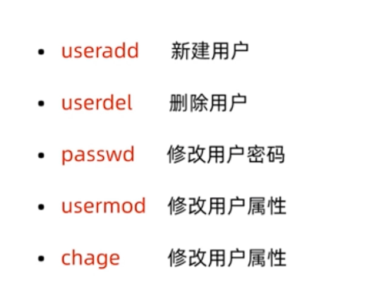

新建用户：useradd 用户名称

用户是否存在：id 用户名称

root用户的根目录：/root

普通用户的根目录：/home/用户名/

/etc/passwd /etc/shadow 用户添加后会添加相关信息到这两个文件

只有管理员才能创建用户

设置用户密码：passwd 用户名

删除用户：userdel 用户名

删除用户的时候默认不加-r（userdel -r 用户名）会保留用户的家目录的文件夹

修改用户属性：usermod 选项 用户名
如修改用户的根目录 usermod -d /home/xxx 用户名（相当于给用户的根目录进行了一次搬家）

修改用户属性：chage

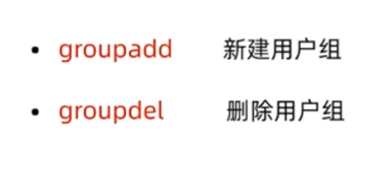

新建用户组 groupadd 用户组

删除用户组 groupdel 用户组

可以将用户的用户组进行修改：
usermod -g 用户组 用户名

也可以在新建用户的同时就加入组：
useradd -g 用户组 用户名

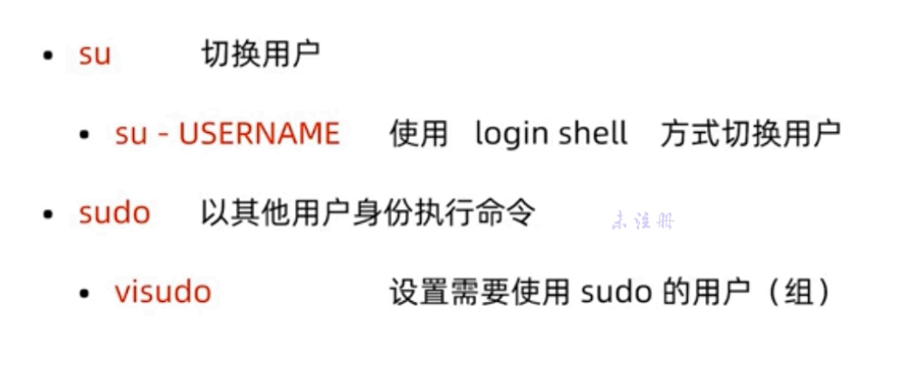

切换用户 su - 用户名

/etc/passwd

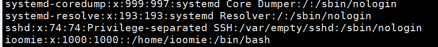

- 用户名
- 是否需要密码
- 用户id
- 用户所在组id
- 用户的根目录
- 注释字段
- 用户登录成功后进入的解释器

可以利用该文件手动创建一个用户

/etc/shadow

存放用户密码

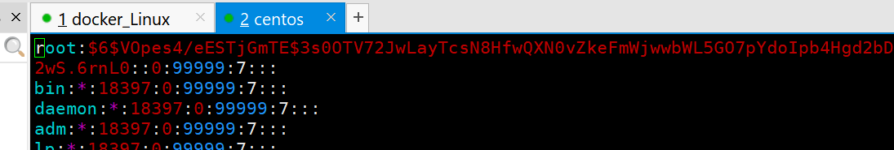

/etc/group

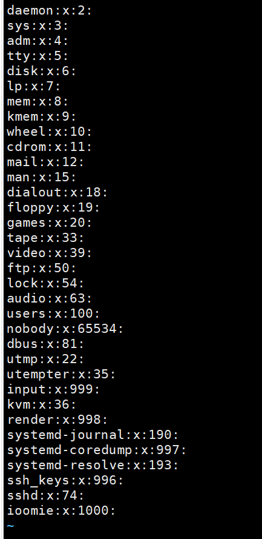

- 组的名称
- 是否需要密码
- 组的id
- 其他组用户的名字（表示这个用户在都属性这两个组）

## 文件权限

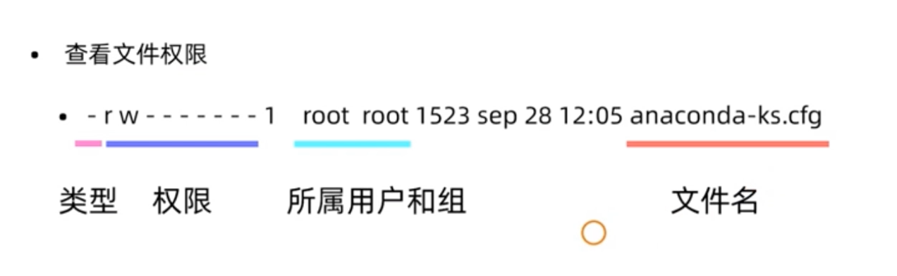

### 文件类型

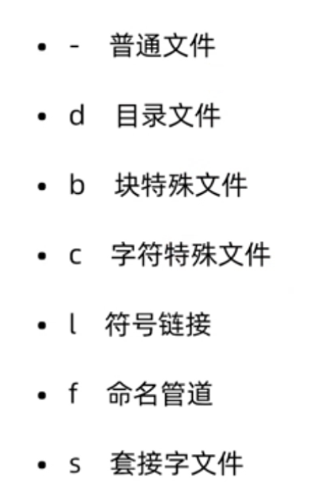

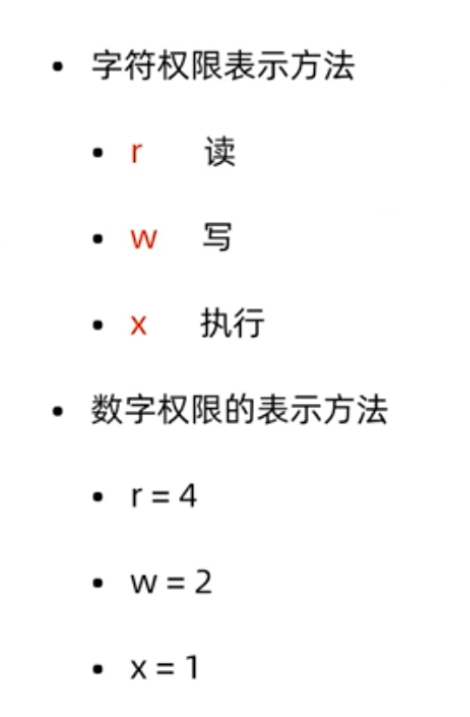

文件权限中一共有9个字符，三个为一组

### 修改文件权限

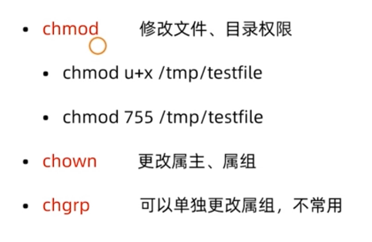

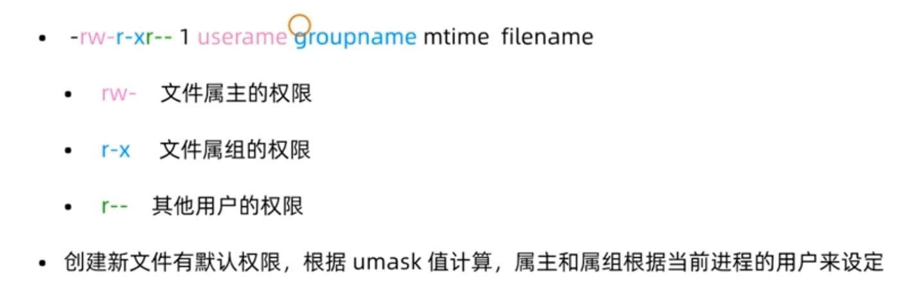

 chown 属主:属组

目录的可执行操作是x，若没有x则无法进入目录

### 特殊权限

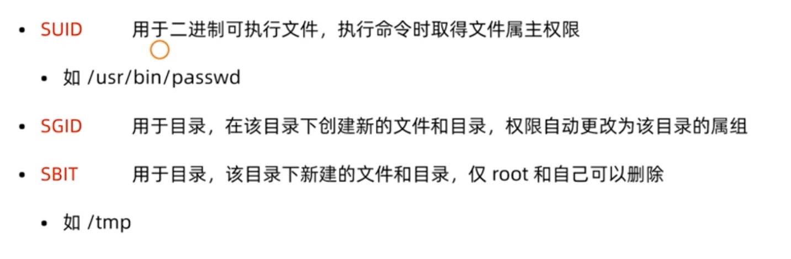

# Vim

## 有四种模式：

- 正常模式
- 插入模式
- 命令模式
- 可视模式

## 关于光标位置：

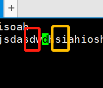

以上图为例，图片中绿色的是光标本身，新的字符会从光标的前面，也就是绿色盖住的d字符前面添加字符，黄色区域的会跟着字符往后走

## 普通模式

### 进入插入模式的命令：

i：进入到当前光标所在位置

shift+i：进入到光标所在行的开头

a：进入到当前光标所在位置的下一个光标位

shift+a：进入到光标所在行的末尾

o：进入到光标所在行的下一行并产生一条空行，将下面原有的行向下推

shift+o：进入到光标所在的上一行并产生一条空行，将下面原有的行像下推

------

v：进入到视图模式

冒号进入到命令模式（shitf+;）

hjkl：在普通模式下对应 **左上下右** 光标的移动

y：复制 yy复制当行 数字+yy复制多行（该行下面的行），y$复制从光标到行尾

d：剪切 dd剪切一整行 数字+dd剪切多行（该行下面的行），d$剪切从光标到行尾

u：撤销上次操作，可多次撤销

ctrl+r：复原上次的撤销

x：删除单个字符

r：替换当个字符

gg：跳转到第一行

shift+g：按行移动光标 数字+shift+g移动到输入的数字行（配合set nu使用）如果不输入数字直接是跳转到最后一行

^：移动到该行的行头

$：移动到该行的末尾

## 命令模式

:w 保存的文件名 保存文件

:q! 不保存退出

:! 可以执行一条linux的命令

/字符 查找字符，按n可以查找匹配到的下一个字符，shift+n查找上一个

:s/旧字符/新字符 替换，这种替换只会针对光标所在的那行进行替换

:%s/旧字符/新字符 全文搜索替换第一个(单次替换)

:%s/旧字符/新字符/g 全局替换

:起始行,结束行s/旧字符/新字符/g 对指定行内的字符进行全局替换

:set nu 显示行号 :set nonu 不显示行号

vim配置文件设置：
/etc/vimrc | /etc/virc

进入到配置文件后可以添加相关的命令进行操作（如添加打开后就显示行号的功能set nu）

## 可视模式

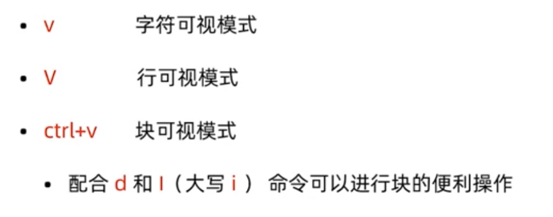

v 按字符选取

shift+v 按行选取

ctrl+v 可视块

当选中字符后按d可以删除字符

# 管理

## 网络管理


网络状态查看

- net-tools
- iproute2

root用户：ifconfig 查看网络信息

普通用户：/sbin/ifconfig

修改网卡的名字：

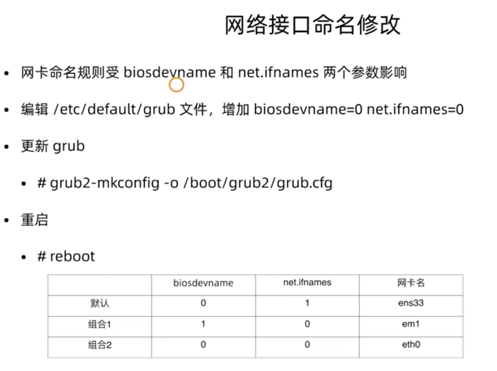

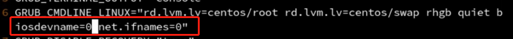

查看网卡物理连接情况，主要是网线连接状态

```
mii-tool eth0
```

查看网关

```
route -n
```

修改网络配置

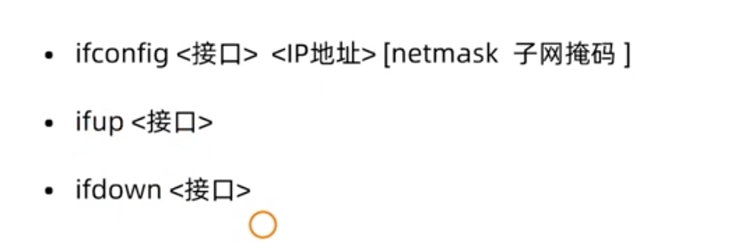

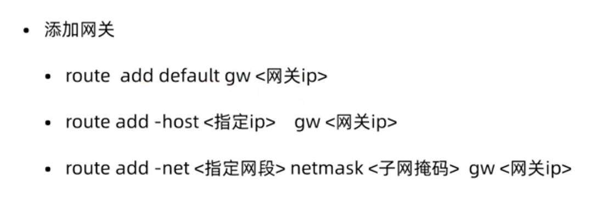

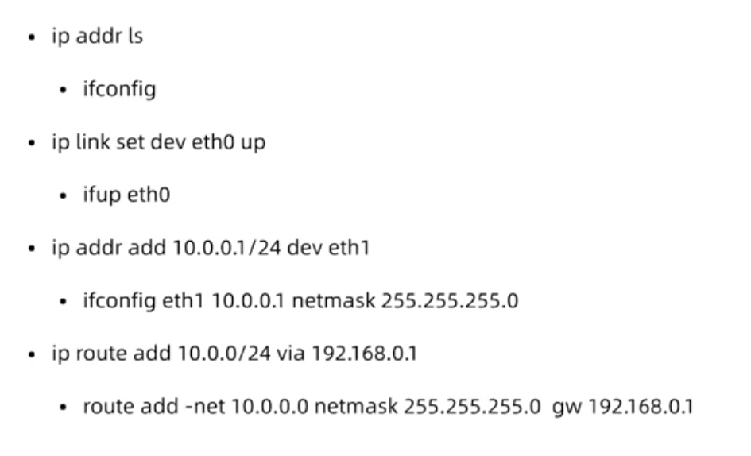

```
修改网络接口参数
ifconfig eth0 10.3.35.147 netmask 255.255.255.0

设定网卡的启动
ifup eth0
ifdown eth0

网关添加和删除
如果默认地址为0.0.0.0为默认网关default
route add default gw xxxxxxxxxx
route del xxxxxxxxxxxxxxxxxxxxx
```

故障排除

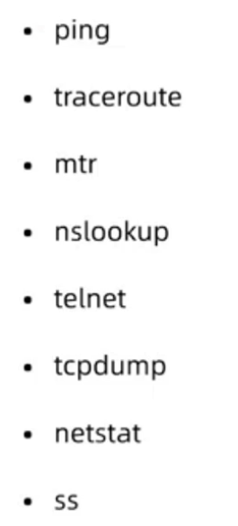

- ping	判断是否畅通
- tarceroute 判断线路间路由的情况
- mtr 网络连通性判断工具
- nslookup 查看域名指向的ip地址
- telnet 判断端口是否能连接
- tcpdump 抓包工具
- netstat -ntpl 用于检测整个Linux系统的网络情况，如服务的启动等
- ss -ntpl 同netstat

服务管理

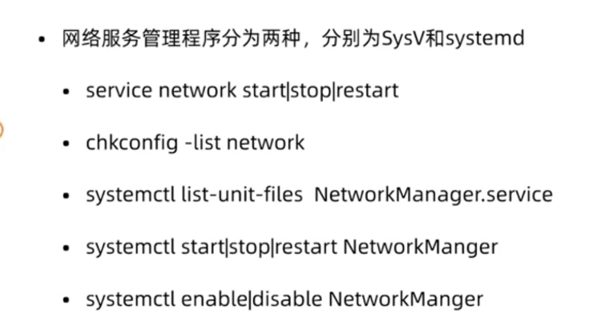

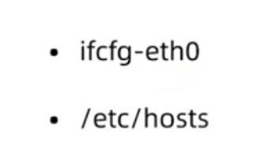

网络接口配置文件目录：

```
/etc/sysconfig/network-scripts/
```

可以进去后进行修改

修改后可利用命令生效：

```
service network restart
```

主机名修改

```
临时修改
hostname ....

非临时
hostnamectl set-hostname xxxxxxxx
修改后需要到 /etc/hosts 中添加对应的主机名

```

## 软件管理

软件安装：

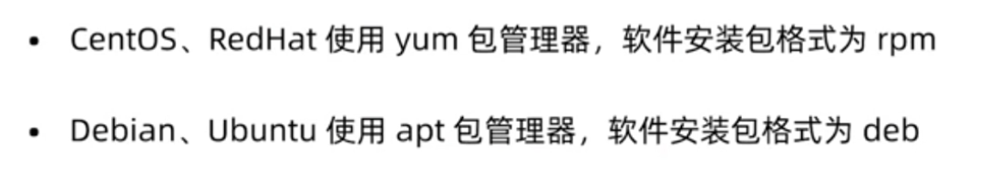

```
yum redhat 红帽
apt-get ubuntu 乌邦图
```

rpm包安装


挂载u盘

```
mount
```

当rpm安装软件的时候要打出全名，当用于查询和卸载的时候只需要软件的名称即可

yum安装配置文件：

```
先备份
mv /etc/yum.repos.d/CentOS-Base.repo /etc/yum.repos.d/CentOS-Base.repo.backup

更换源
/etc/yum.repos.d/CentOS-Base.repo

wget -O /etc/yum.repos.d/CentOS-Linux-BaseOS.repo http://mirrors.aliyun.com/repo/Centos-8.repo

换完后需要更新缓存
yum makecache
```

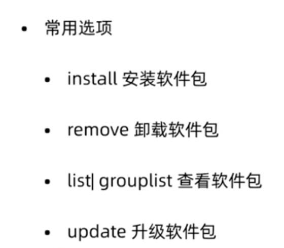

源代码编译安装

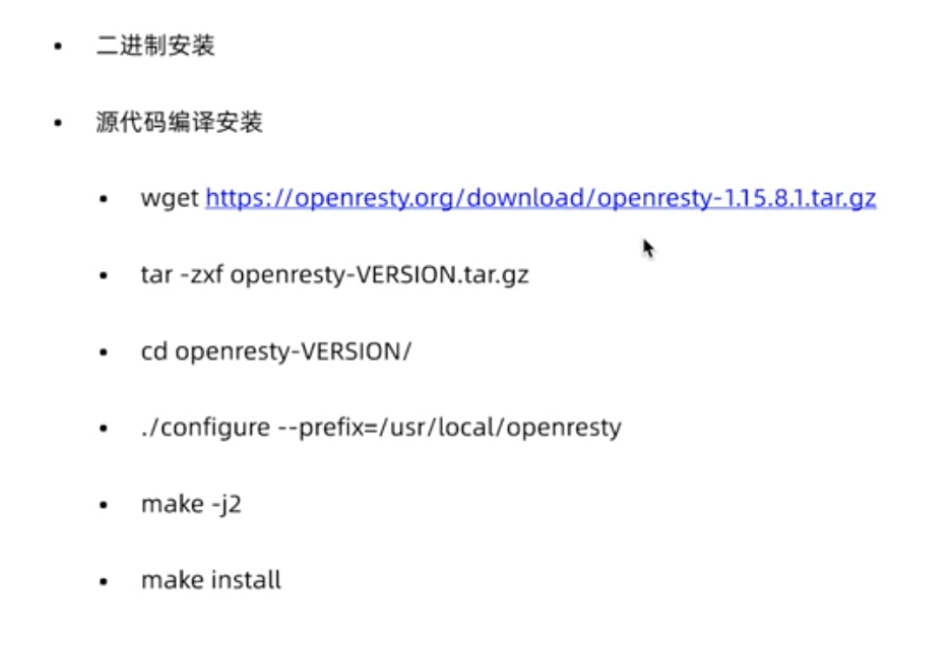

1. 下载软件包
2. 解压缩
3. 进入到源代码目录
4. 执行configure文件，configure，将文件放在指定的文件（--prefix=/xxx/xxx/xxx）
5. 编译源文件
6. 执行安装

内核安装

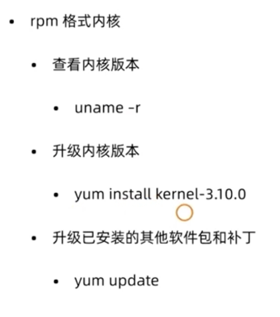

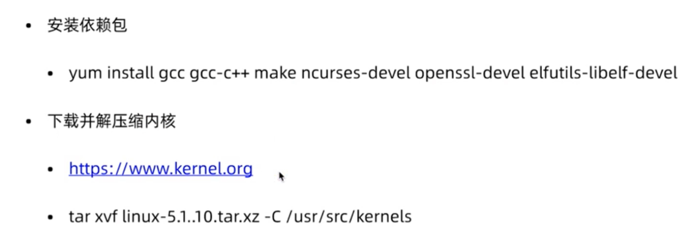

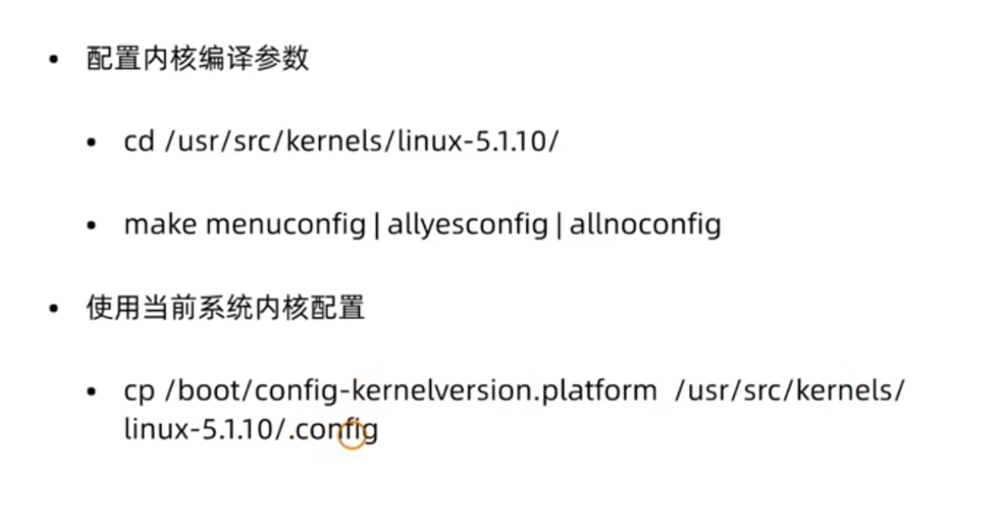

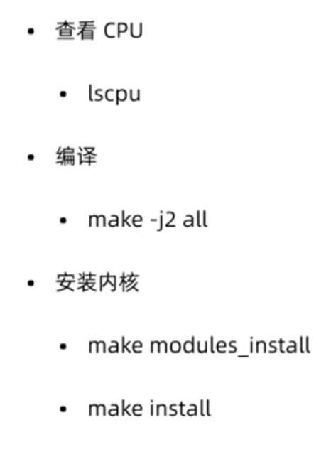

安装拓展包模块：

```
yum install epel-release -y
```

安装最新的内核：

```
yun install kernel
```

grub引导

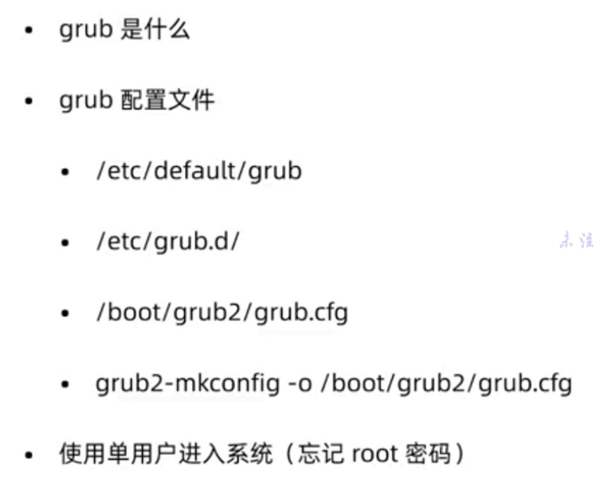

使用grub修改个人密码

*这里先暂时放下*

## 进程管理