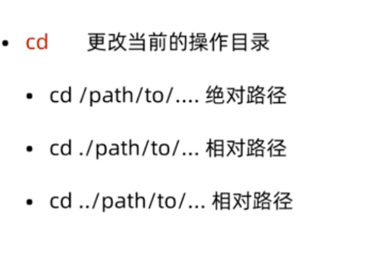

# Linux学习总结

一切皆文件

# 命令大全

## pwd

pwd 显示当前目录

## ls

ls 列出目录内容
ls /root
ls /root /home

### 长格式显示

ls -l

从左到右边依次是：

*目录权限，包含文件数，创建用户，用户所属用户组，文件大小，文件创建时间，文件名*

### 显示隐藏文件

ls -a

### 逆向显示

默认逆向文件名字

ls -r

以对时间逆向

ls -r -t

### 简化操作

ls -lrt

### 递归显示

ls -R

## cd

### 绝对路径

cd /xxx/xxx/xxx

### 返回上次目录

cd -

当前目录用 **.** 替代
**.** 和 **/** 可以省略

**..**上级目录

### 返回上级目录

cd ..

