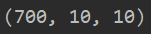

# MVC、MVP、MVVM设计模式


*首先上面的三种模式都是对项目代码的一种拆分，而不同的模式代表对代码进行不同的拆分*

*目前我只粗略学习了MVC和MVP，对于MVVM模式还未学习*

*具体的案例将会用Android做例子*

## MVC

首先套图：


在MVC中有三个部分：**View，Controller，Model**

这三个部分的数据走向是单向的，这里举一个用户登录的例子（以Android为例）：

1. 首先用户在打开界面的时候就会见到我们的界面View，在Android中，View的对应的是我们的xml文件，也就是布局文件，用户可以在View中进行交互
2. 当用户输入了用户名密码并点击登录后，View就会把数据传给我们的Controller，在这里面对应的就是Activity，在这里是不会（不应该）实现业务代码的，而是将业务逻辑全部放到Model中，在Activity中通过接口的形式调用Model实现数据的传输
3. 当数据传过来后，Model就会将收到的数据投入到业务处理中，由Model去做一些数据库上或者服务器上的访问（包括判空），并将访问结果告知到View中（比如用户的密码错误，就可以在View中弹窗告诉用户密码错误了）

## MVP


在MVP中有三个部分：**View，Presenter，Model**

还是以一个Android的登录应用为例子：

1. 首先用户通过页面，也就是View，此时这里的View是由Activity去充当的，用户通过这里输入数据进行登入
2. 此时数据传给Presenter，这里就是从Activity中抽取得到的逻辑代码（接口的各种调用，就是将原先在Activity中的各种接口调用写到另一个整合之中，Activity只包含对界面的控制），在Presenter中通过不同的接口调用去调用对应的Model
3. 当Model拿到数据后就进行数据库或者网络的访问（同MVC中的Model），但是在访问完得到结果后并不是将结果返回给View，而是将结果返回给Presenter，再由Presenter返回给View

*在这里可以有多个View使用一个Presenter，或者一个View用多个Presenter，但通常是一对一*

两者相同点：

- 首先两者都能降低一定的代码耦合度，都能将模块间的职责划分的很明显，这样可以一定程度隐藏数据，并提高代码的灵活性和复用性，也更利于进行测试
- 但两者都会增加一定程度的代码复杂度以及需要一定的学习成本

抄来的一句话总结：**代码逻辑有没有写在View中的,有就是MVC,没有就是MVP**

# Python垃圾回收机制

*首先对于Python，要明白在Python中万物皆对象*

在python中当一个程序运行的时候会有很多对象被生成，当程序里的对象的生成达到一个阈值的时候（可以设定下面会说），则会启动垃圾回收

在对象中有个 **引用计数** ，当一个元素应用了某个对象，该对象的引用就会+1。当对象的引用计数为0的时候就代表着没有被任何元素或者其他对象引用，进而会被回收。

垃圾回收可以自动触发，也可以手动启动，而触发的机制就是达到一个阈值，阈值的查看方法：

```
import gc
print(gc.get_threshold())
```

一般返回：



我们也可以手动启动垃圾回收：

```
gc.collect()
```

## 分代回收

以空间换时间，将对象存活时间划分为不同的集合，每个集合称为一个代，一共有三个代对应三个列表，对应 年轻代、中年代、老年代 新创建的对象都在年轻代。

每当启动一次垃圾回收的时候都会对目前的第0代的对象进行扫描，而经过这次扫描后，这个对象没有被回收，则这个对象就会被分配到下一个代中。上面的返回阈值后面的10，10代表这后代扫描次数的阈值，比如第一个10表示当经历过10次第0代的扫描后，才会对第1代扫描一次，第二个10表示当第1代经历过10次扫描后，才会对第2代扫描一次

## 引用环（标记-清除）

在这种方式先下可以解决循环引用的情况。Python并不会将对象里真正的引用计数作修改，而是会将所有的对象的引用计数复制成一共副本，对副本进行操作。

在遍历完之后，Python会对每个对象的引用对象（假设现在有个obj1对象，obj2引用了j对象，可以理解为指向j对象）相应的对其引用计数-1。在执行这个操作后会有一个反馈，如果obj1指向obj2，obj2也指向obj1，那当他们其中的一个因为计数的问题（当obj2取消了指向，就会导致obj1的计数为0）整个引用环就会被破坏，就会被回收。

而如果obj2和obj1之间并不够成引用环，则obj1在遍历完后其引用计数不为0，则该obj1对象包括其下面的所有引用链都会被保留


*上面这个图很生动说明了，左边不会被回收，右边会被回收*

# SSL加密

*这里是简单原理*

## 对称加密

对称加密算法指同一个密钥可以用来加密也可以用来解密，也称作但密钥加密

## 非对称加密

非对称加密（RSA），指有两个密钥，一个公钥，全部人都可以知道的钥匙。而另一个是私钥，只有持有者自己一个人知道。通过公钥加密过的内容只有私钥能解开。安全性高，消耗的性能也高

## 原理

首先SSL将上述的两种加密方式都用运用，其实现的原理如下

1. 客户端向服务端请求
2. 服务端接收请求，返回 **数字证书**
3. 客户端的浏览器将证书进行认证，由TLS（安全传输层）完成
   1. 浏览器从证书中索引找到对应机构的公钥，没找到为不可信任
   2. 用机构的证书公钥解密得到内容和签名
   3. 浏览器生成一个随机数R，用网站公钥对R进行加密
4. 浏览器将加密的R传回给服务器
5. 服务器用自己的私钥解密得到R
6. 服务器用密钥R对内容进行加密并传回给浏览器
7. 浏览器以密钥R对内容进行解密得到内容

总体流程：


# 创建一个免费的图床

*如果有钱有时间请利用阿里云oss或者其他的云平台退出的对象存储服务，目前的方式只能说是投机行为*

首先创建一个gitee的账号（国内的代码托管平台），操作和git一样，创建仓库建立自己图片仓库，而占用大小的话...


5个G能用蛮久的吧...

随后添加ssh，这样利用ssh上传和下载不会和github发账号上的冲突，随后可以放入一些图片做测试

在做完一些列的git推送操作后，可以上gitee的仓库上查看图像


此时还不能直接在Markdown上以URL的方式查看，这时候要点击服务，开通Gitee Pages


随后可以在页面中看到一个开启的按钮（我这里开过了所有没有）


更新完后上面红色箭头会有一个网址，这个网址+上图片的文件名就可以在MarkDown上看到图片了（在国内不用遭受github速度太慢或者直接加载不出来而难受）

然后在Typora上可以用 CTRL+H 的操作 将图片文件名的头换成刚刚的网站地址（先用CTRL+/进入源码模式）：


这里现场就用，在查找全部后选择全部替换，注意上面图中的格式斜杠还是反斜杠

随后就可以看到图片在自己的文档上，只要有网就能看到图片了